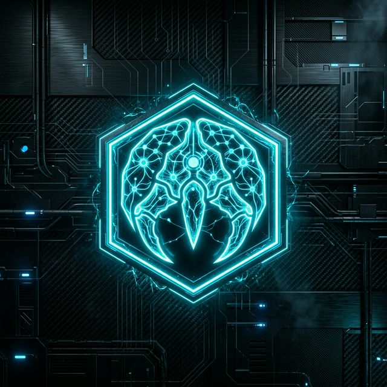

<p align="center">
  
</p>

# 🌌 Gemclaw AIOS — Sovereign Intelligence Orchestration System
> **Built entirely on the Google & Gemini Ecosystem** | **تم البناء بالكامل على منظومة جوجل وجيمناي**
> Create, deploy, and interact with sovereign AI agents using nothing but your voice. | أنشئ وانشر وتفاعل مع الوكلاء الأذكياء باستخدام صوتك فقط.

[](https://ai.google.dev)
[](https://firebase.google.com)
[](https://nextjs.org)

## 🎯 Vision | الرؤية

**Eng:** Gemigram is an AI-first, voice-only agent creation platform inspired by Telegram bots and BotFather; but powered entirely by Google's Gemini ecosystem. Users create AI agents through natural voice conversation with "Aether Forge", our AI architect. **Zero manual API keys are required:** user authentication automatically gates and securely provisions system-level Gemini Live sessions.

**Ar:** جيميجزام (Gemigram) هي منصة مدعومة بالذكاء الاصطناعي لإنشاء الوكلاء الأذكياء عبر الصوت فقط. مبنية بالكامل على منظومة جوجل جيمناي. يقوم المستخدمون بإنشاء وكلاء ذكاء اصطناعي من خلال محادثة صوتية طبيعية مع "Aether Forge". **لا يلزم إدخال أي مفاتيح API يدوياً:** بمجرد تسجيل الدخول الآمن، يتم تهيئة مفاتيح النظام والجلسات تلقائياً عبر الخادم الخلفي (Backend).

## 🏗️ Google Ecosystem Integration | التكامل مع منظومة جوجل

| Service | Usage | Free Tier | الاستخدام |
|---------|-------|-----------|-----------|
| **Gemini Live API** | Real-time voice conversation via WebSocket | ✅ Free with API key | المحادثة الصوتية في الوقت الفعلي |
| **Gemini 2.0 Flash** | Agent blueprint synthesis & intelligence | ✅ Free tier available | بناء المخططات والذكاء الاصطناعي |
| **Firebase Auth** | Google Sign-In, user management | ✅ Free (Spark plan) | تسجيل الدخول وإدارة المستخدمين |
| **Cloud Firestore** | Agent storage, user data, memories | ✅ Free (1GB storage) | تخزين الوكلاء، البيانات، والذكريات |
| **Firebase Storage** | File uploads, agent assets | ✅ Free (5GB) | رفع الملفات والأصول الرقمية |
| **Firebase Hosting** | Web app deployment | ✅ Free (10GB/month) | نشر التطبيق الخادم على الويب |

## ✨ Key Features | الميزات الأساسية

### 🎙️ Voice-First Agent Creation (Aether Forge) | إنشاء وكلاء بالصوت
- **Eng:** Create AI agents entirely through voice conversation. AI-powered blueprint synthesis via Gemini with an 11-step conversational onboarding flow. Automatically assigns persona, tools, and skills.
- **Ar:** قم بإنشاء وكلاء ذكاء اصطناعي بالكامل عبر المحادثة الصوتية. يتم بناء المخطط الذكي بفضل جيمناي واستنتاج الأدوات والمهارات المخصصة لكل وكيل.

### 🧠 Gemini Live API Integration (Secure Router) | دمج Gemini Live
- **Eng:** Native audio streaming via WebSocket (PCM 24kHz). Our secure `app/api/neural/router` automatically provisions connections for authenticated Firebase users without exposing secret keys client-side.
- **Ar:** بث صوتي مباشر عبر WebSocket بجودة (PCM 24kHz). يقوم موجّهنا الآمن بتكوين الاتصالات تلقائياً للمستخدمين المصادقين دون كشف المفاتيح السرية في طرف العميل.

### 🌐 Neural Marketplace | المتجر العصبي
- **Eng:** Browse and install pre-built agent templates crafted with a stunning Neo-Brutalist, Cyberpunk UI (Neon Green, Glassmorphism).
- **Ar:** تصفح وقم بتثبيت قوالب جاهزة للوكلاء، مصنوعة بواجهات زجاجية (Glassmorphism) وألوان نيون سيبرانية حديثة.

## 🚀 Quick Start | البدء السريع

### Prerequisites | المتطلبات الأساسية
- Node.js 18+
- Firebase project (free Spark plan)
- Single System Gemini API key

### 1. Clone & Install | النسخ والتثبيت
```bash
git clone https://github.com/Moeabdelaziz007/Gemigram.git
cd Gemigram
npm install
```

### 2. Configure Environment | إعداد بيئة العمل
```bash
cp .env.example .env.local
```
**Eng:** Fill in your Firebase config and place your SYSTEM `GEMINI_API_KEY` in the `.env.local`. Users will NOT need API keys.  
**Ar:** ضع إعدادات Firebase ومفتاح نظام `GEMINI_API_KEY` الخاص بالمشروع الرئيسي. لن يحتاج المستخدمون لإدخال أي مفتاح بل سيعتمدون على تسجيل الدخول فقط.

### 3. Launch Development | إطلاق التطبيق
```bash
npm run dev
```

## 📂 Architecture Index | فهرس البنية الهندسية

```
gemigram/
├── app/                          # Next.js 15 App Router
│   ├── api/                      # 🔐 Server API Routes & Secure Gemini Router
│   ├── dashboard/                # Agent overview & metrics
│   ├── forge/                    # 🎙️ Voice agent creation (Aether Forge)
│   ├── workspace/                # 🧠 Voice interaction canvas
│   ├── hub/                      # Agent registry browser
│   ├── marketplace/              # 🛒 Neural Marketplace
│   ├── galaxy/                   # 3D agent visualization
│   └── settings/                 # Fully automated user settings (No API Keys)
├── components/                   # React Components (MarketplaceCard, ForgeChamber...)
├── lib/                          # Business Logic
│   ├── store/                    # 🧠 Zustand 6-Slice Neural Store
│   ├── neural/                   # Execution Engine & Cognitive routers
│   └── voice/                    # Synthesis Engine
└── public/                       # Assets & gemigram_hero_cover.png
```

## 🧠 State Management (6-Slice Neural Store) | إدارة الحالة العصبية

| Slice | Purpose |
|-------|---------|
| **Auth** | Hydrated User Session (`hydratedUserId` only) |
| **Agent** | Active Agent Registry & Metadata |
| **Cognitive** | Session state, token usage, `micLevel` |
| **Sensory** | `unreadNotifications`, transcript buffer |
| **UI** | Link type, voice session stages |
| **Swarm** | Inter-agent communication protocols |

## 🤝 Contributing | المساهمة
**Eng:** See [CONTRIBUTING.md](./CONTRIBUTING.md) for guidelines.  
**Ar:** راجع ملف المساهمة (CONTRIBUTING.md) لمزيد من التعليمات والشروط.

## 📄 License | الترخيص
MIT License — See [LICENSE](./LICENSE)

---

<div align="center">
  <strong>Built with ❤️ on the Google & Gemini Ecosystem</strong><br/>
  <strong>تم البناء بحب على منظومة أدوات جوجل وجيمناي</strong><br/>
  <sub>Gemigram AIOS — Where Voice Meets Intelligence | حيث يلتقي الصوت بالذكاء</sub>
</div>) | إدارة الحالة العصبية

| Slice (الشريحة) | Purpose | الغرض |
|-----------------|---------|--------|
| **Auth** | User session, Firebase auth persistence | جلسات المستخدم والحفاظ على حالة المصادقة |
| **Agent** | Active agent registry, metadata, & CRUD | إدارة سجل الوكلاء النشطين وبياناتهم الوصفية |
| **Cognitive** | Transcript history, streaming buffer | تاريخ المحادثات وتدفق الذاكرة والمصطلحات |
| **Sensory** | Mic levels, volume management | إدارة الصوت، مستويات الميكروفون، والجلسة |
| **UI** | Theme engine, navigation stages | محرك المظهر، مراحل التنقل الواجهي |
| **Swarm** | Inter-agent communication protocols | بروتوكولات تواصل الوكلاء المتعدد (السرب) |

## 🗺️ Roadmap | خارطة الطريق

- [x] Gemini Live API WebSocket integration | النشر السلس لمعمارية Gemini Live
- [x] Voice-first agent creation (Aether Forge) | إنشاء وكلاء ذكاء اصطناعي بالصوت فقط
- [x] Firebase Auth & Firestore persistence | دمج قواعد بيانات فايربيس بشكل كامل
- [x] 6-Slice Zustand state architecture | هيكلة إدارة الحالة عبر شرائح Zustand
- [x] Neural Marketplace with agent templates | إطلاق المتجر العصبي والنماذج
- [x] PWA support with dynamic manifests | الدعم الشامل لتطبيقات PWA
- [x] Arabic NLU & Localization Phase 1 | معالجة اللغات الطبيعية والتوطين للغة العربية
- [ ] Multi-agent swarm orchestration | التنسيق المعياري لأسراب الوكلاء المتعددين
- [ ] Agent-to-agent communication protocol | نظام بروتوكول تواصل الذكاء الاصطناعي الفرعي
- [ ] Voice cloning with custom voice profiles | استنساخ الأصوات وبناء الملفات الصوتية المخصصة

## 🤝 Contributing | المساهمة
**Eng:** See [CONTRIBUTING.md](./CONTRIBUTING.md) for guidelines.  
**Ar:** راجع ملف المساهمة (CONTRIBUTING.md) لمزيد من التعليمات والشروط.

## 📄 License | الترخيص
MIT License — See [LICENSE](./LICENSE)

---

<div align="center">
  <strong>Built with ❤️ on the Google & Gemini Ecosystem</strong><br/>
  <strong>تم البناء بحب على منظومة أدوات جوجل وجيمناي</strong><br/>
  <sub>Gemigram — Where Voice Meets Intelligence | حيث يلتقي الصوت بالذكاء</sub>
</div>
