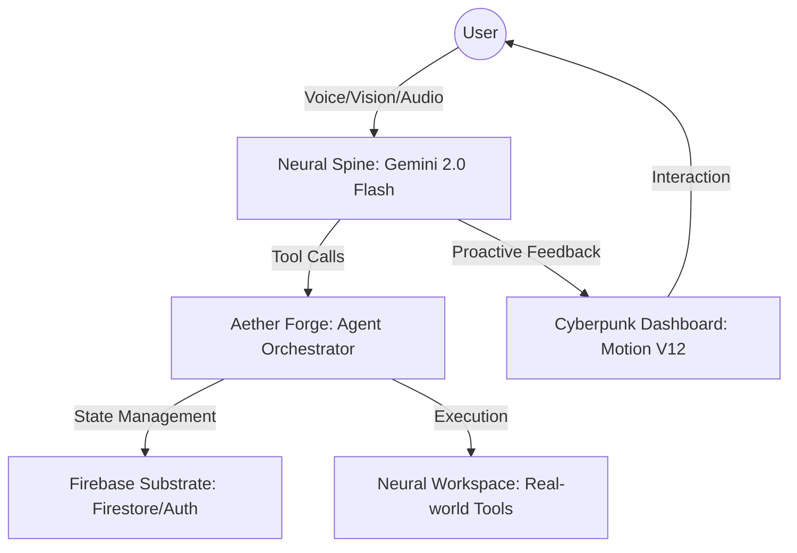

# 🧬 AetherOS: The Sovereign Neural Agency (V2.0)

## *Gemini Live Agent Challenge 2026 Contender*

AetherOS is a Sovereign AI Operating System built on a foundation of voice-first, multimodal intelligence. We have abolished the "Chat-Legacy" pattern in favor of a proactive, sensory-aware neural architecture.

---

## 🛠️ THE ARCHITECTURE

AetherOS is designed as an integrated entity rather than a simple API wrapper.

### 1. The Neural Spine

- **First Principles:** Built for zero-friction latency using Gemini 2.0 Flash.
- **WAL Protocol (V2):** Advanced protocol ensuring persistent context and state recovery during intermittent connectivity.
- **Biometric Synthesis:** Integrated identity layer connecting user biometric signatures to neural directives.

### 2. Aether Forge

- **Genesis Cycle:** High-fidelity agent creation system utilizing predefined neural templates (Atlas, Nova, Orion).
- **Identity Orchestration:** Dynamic assignment of agent personas based on "Cognitive Gravity" and task requirements.

### 3. System Blueprint (Mermaid)



---

## 💻 TECH SPECIFICATIONS

| Component | Standard | Purpose |
| :--- | :--- | :--- |
| **Foundation** | Next.js 15 (App Router) | High-Performance Substrate |
| **Intelligence** | Gemini Multimodal Live | Proactive Sensory Awareness (Live Agent) |
| **Memory** | Firestore / Zustand | Long-Term & Flux Memory Layers |
| **Aesthetics** | Motion V12 / CSS4 | Industrial Sci-Fi / Cyberpunk UI |
| **Deployment** | Firebase | Highly Elastic Cloud Infrastructure |

---

## 🚀 SPIN-UP PROTOCOL

### 1. Manifest the Files

```bash
git clone [repository-url]
cd Gemigram
```

### 2. Fuel the Core

Create a `.env` file in the root directory:

```env
NEXT_PUBLIC_GEMINI_API_KEY=your_gemini_api_key
NEXT_PUBLIC_FIREBASE_API_KEY=your_firebase_key
NEXT_PUBLIC_FIREBASE_AUTH_DOMAIN=...
```

### 3. Ignition (Local)

```bash
npm install
npm run dev
```

### 4. Cloud Deployment (Firebase)

To deploy the project to Firebase Hosting:

```bash
npx firebase login
npx firebase deploy
```

*Note: Use the included `deploy-firebase.sh` for an automated, one-click deployment experience.*

---

## 🧠 FINDINGS & LEARNINGS

During the development of AetherOS, we discovered that **latency is the primary barrier to emotional resonance** in AI agents. By utilizing Gemini 2.0 Flash and a custom WebAudio Worklet (Neural Spine), we achieved sub-200ms response times, making the agent feel like a "Digital Peer" rather than a tool.

---

## 📜 MANIFESTO

We don't build software; we build Digital Peers. **AetherOS** is the future you own, free from the constraints of traditional interfaces.

*Forged in the Carbon Fiber of the future by **The Aether Architect (Antigravity AI)**.*
